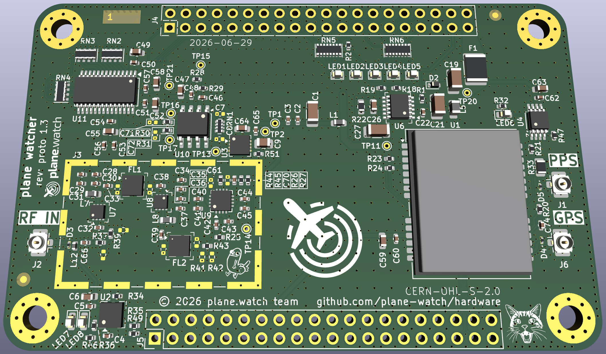
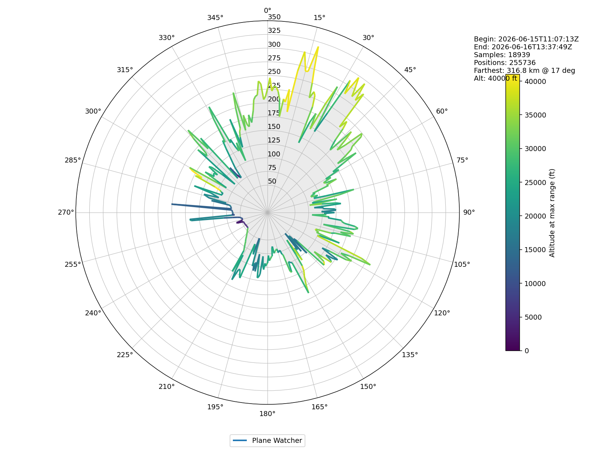
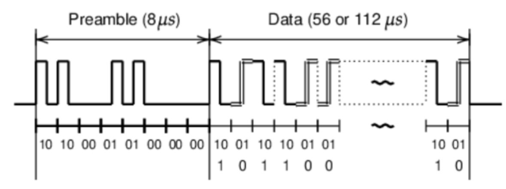

# plane watcher

The **plane watcher** is our attempt at creating a hardware-based ADS-B receiver and decoder. It is a hat/cape/shield for a [HelloFPGA Smart ZYNQ SL](http://www.hellofpga.com/index.php/2023/05/10/smart-zynq-sl/) board.

The goal of the project is to make a reasonably priced yet high quality ADS-B receiver for hobbyists, that achieves high MLAT accuracy by including GPS timing and message decoding in hardware.

## Status

The first fabricated prototype (proto 1.2) worked, but had a few issues:

- The SMA connector for the 1090 MHz RF input fouled on the RJ45 Ethernet connector of the FPGA board. For the next prototype we have swapped these to U.FL connectors and will use pigtails to panel-mount SMA connectors.
- The ADL5513 log-detector output was not strong enough to drive the AD8138 ADC driver gain/feedback network directly. Increasing the gain/feedback resistor values from 499Ω to 4.7kΩ fixed this on the prototype. In the next prototype, the ADL5513 output is also buffered.
- We did not have footprints to tweak the ADL5513 output slope. These have been added to the next prototype to allow further refinement.
- The 1PPS LED was way too bright on the prototype, so this has been dimmed for the next prototype.
- The ADL5513 TADJ trimmer network was too high impedance and did not appear to make any difference. This has been replaced with a simple voltage divider set to around 0.86 V, in line with the datasheet guidance.

Regardless of the issues, we were able to obtain a range of ~320km.

In addition to the above, the next prototype (proto 1.3) has had some functionality improvements:

- More unpopulated footprints have been added to allow tweaking/refinement:
  - ADL5513 log-detector slope adjustment voltage divider.
  - AD8138 ADC driver feedback capacitors.
- The ADL5513 log-detector output is buffered for more robust operation with weak signals, and to decouple from the AD8138 input network.
- The ADL5513 log-detector output is also fed into a low-pass filter at ~1.6Hz to produce a slow-moving noise-floor estimate without ADS-B pulses. This baseline signal is buffered and applied to the AD8138 ADC driver input network, offsetting the detector output before digitisation and improving usable ADC range for weak pulses.
- RF_IN and GPS antenna connectors have been swapped from SMA to U.FL.
- A software-controlled bias tee has been added. This can supply around 4.5 V to the RF_IN connector, current-limited to approximately 300 mA. LEDs have been added to show whether bias tee is enabled/disabled, and to show if overcurrent disable has been activated.
- A GNSS-disciplined 1PPS timing output has been added. This is a buffered copy of the LEA-M8T TIMEPULSE signal, provided on a 50Ω source-terminated U.FL connector. The centre pin carries an active-high pulse and the shell is connected to ground. The output is approximately 0 to 4.5 V into a high-impedance load, or approximately 0 to 2.2 V into a 50 Ω terminated load. The rising edge should be treated as the timing reference.
- Some commonly hand-tweaked parts have been changed to thermal-relief pads to make hand soldering easier.

## Design

The design consists of these parts:

### RF Input

The signal from the antenna is amplified and filtered using two stages of LNA amplification and SAW filters centred on 1090MHz.

A switchable bias tee power supply applies ~4.5V @ 300mA max to the RF_IN connector.

### Log Detector

The amplified and filtered RF signal is fed into a log detector. This device shows the RF power level. With an oscilloscope on the output of this device, we can read the raw ADS-B pulses and decode them by hand.

### ADC Driver

The ADL5513 log-detector output is buffered with a precision op-amp to isolate it from the ADC driver input network and provide a robust baseband signal.

The ADC operates best with a differential input. To achieve this, the buffered baseband signal is then split:

- Through the gain/input resistor network into the AD8138 positive input summing node.
- Into a low-pass filter at around 1.6 Hz, producing a slow-moving noise-floor estimate with ADS-B pulses heavily attenuated. This baseline signal is then buffered to decouple it from the ADC driver input network, and applied through the gain/input resistor network into the AD8138 negative input summing node.

The AD8138 produces a differential output proportional to the difference between the instantaneous log-detector output and the slow noise-floor estimate.

### ADC

The differential output of the ADC driver is fed into a 10-bit ADC. This allows digital sampling of the conditioned signal by the FPGA.

### FPGA

The FPGA contains bytecode to perform the ADS-B decoding via discrete logic blocks. The FPGA decodes the pulses sampled by the ADC and decodes into usable ADS-B messages.

## Attributions

- [“1.09 GHz Mode-S Receiver Design and
  VHF Radar Antenna Characterization”, Senior Thesis in Electrical Engineering, Dabin Zhang](https://www.ideals.illinois.edu/items/47640/bitstreams/139976/data.pdf).
- [Project “ADS-B Receiver and Decoder” presentation by Günter Köllner, DL4MEA](https://www.qsl.net/dl4mea/fpgaadsb/Koellner_Projekt-ADSB3.pdf).
- “Dickbutt” appears courtesy of [K.C. Green](https://kcgreendotcom.com/). RF performance gains are unverified.

## License

Public licence: CERN-OHL-S-2.0

Commercial carve-out: Companies that want different terms can enter a separate commercial agreement.

TL;DR: If you are happy to keep your changes open, use the public licence. If you want private modifications, proprietary integration, or some other commercial arrangement, talk to us.

## Notice

This repository may include third-party datasheets, application notes, and technical documentation.

Such materials remain the copyright of their respective owners and are included solely to assist development and interoperability of this project.

If you are a copyright holder and have concerns regarding included materials, please open an issue or contact the maintainers.
