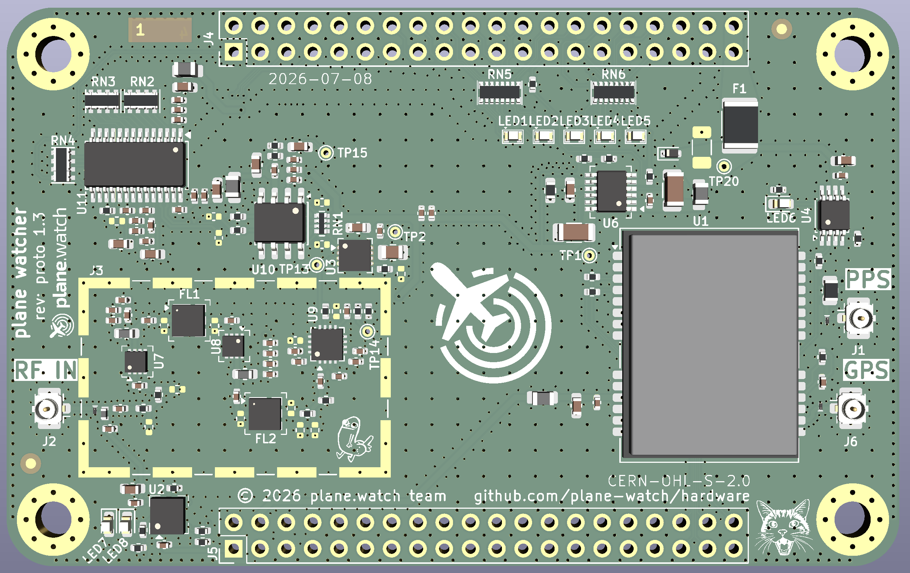
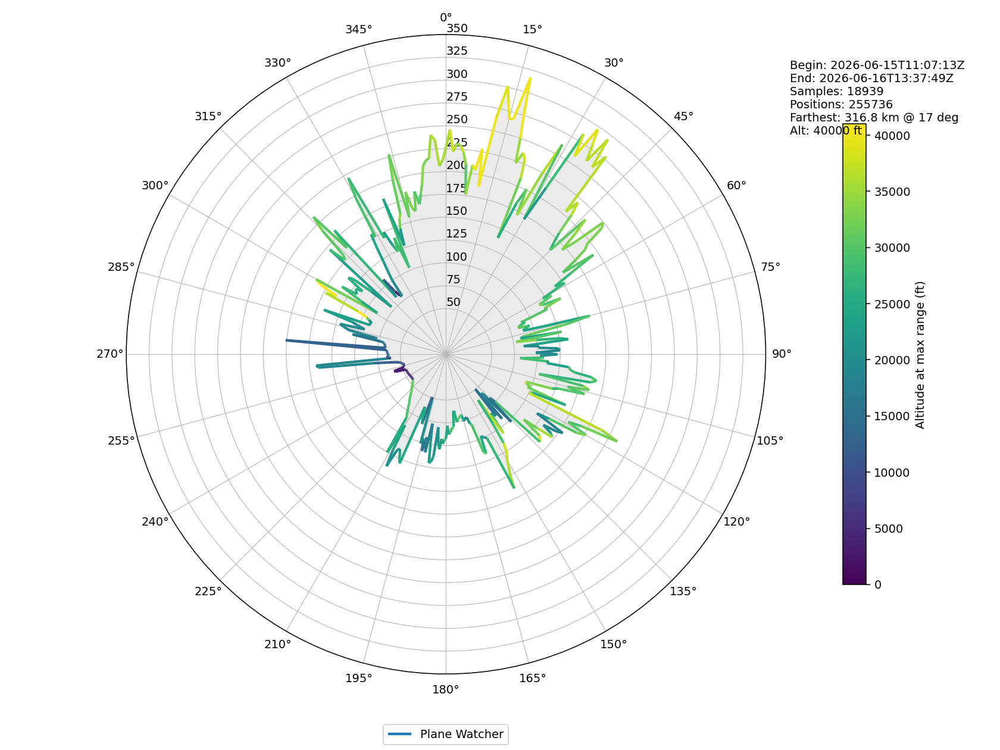
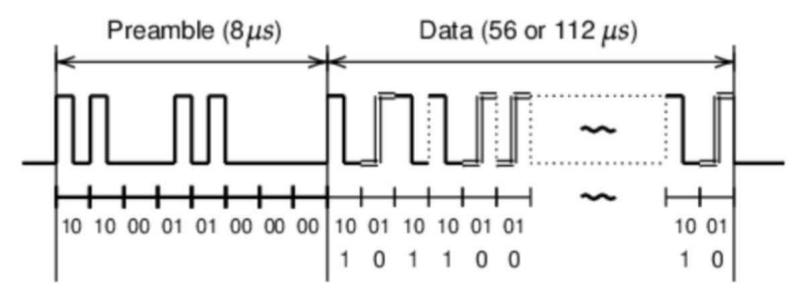
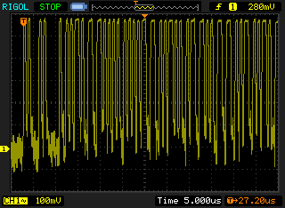

# plane watcher

The **plane watcher** is our attempt at creating an open source, hardware-based ADS-B receiver and decoder. It is a hat/cape/shield for a [HelloFPGA Smart ZYNQ SL](http://www.hellofpga.com/index.php/2023/05/10/smart-zynq-sl/) board.

The goal of the project is to make a reasonably priced yet high-quality ADS-B receiver for hobbyists. It is designed to support accurate MLAT timestamping using GNSS timing and message decoding in the FPGA.

This repository contains the hardware design. The FPGA gateware and software live in the [plane-watch/plane-watcher](https://github.com/plane-watch/plane-watcher) repository.

## Status

Proto 1.2 is the latest fabricated and tested revision. Proto 1.3 is still being refined and has not yet been fabricated or validated.

### Proto 1.2

The first fabricated prototype worked, but had a few issues:

- The SMA connector for the 1,090 MHz RF input fouled on the RJ45 Ethernet connector of the FPGA board. For proto 1.3, the RF and GPS antenna connectors have been swapped to U.FL. We will use pigtails to panel-mount SMA connectors.
- The ADL5513 log-detector output was not strong enough to drive the AD8138 ADC driver gain/feedback network directly. Increasing the gain/feedback resistor values from 499 Ω to 4.7 kΩ fixed this on the prototype. In proto 1.3, the ADL5513 output is also buffered.
- We did not have component footprints to tweak the ADL5513 output slope. These have been added to proto 1.3 to allow further refinement if required.
- The 1PPS LED was way too bright on the prototype, so this has been dimmed for proto 1.3.
- The ADL5513 TADJ trimmer network was too high impedance (I should've read the data sheet better) and did not appear to make any difference whatsoever. This has been replaced with a simple voltage divider set to around 0.86 V, in line with the datasheet guidance.

Regardless of the issues, we observed a reception range of approximately 320 km.

### Proto 1.3

In addition to fixing the issues above, proto 1.3 includes some functionality and layout changes:

- More unpopulated component footprints have been added to allow tweaking/refinement:
  - ADL5513 log-detector slope adjustment voltage divider.
  - AD8138 ADC driver feedback capacitors.
  - Various RF matching/tweaking footprints along the RF path and ADC signal path.
- The ADL5513 log-detector output is buffered for more robust operation with weak signals, and to decouple from the AD8138 input network.
- The buffered log-detector output is also fed into a first-order low-pass filter at approximately 0.072 Hz to produce a slow-moving analog baseline. This heavily attenuates short ADS-B pulse bursts, but sustained RF traffic can still affect the baseline. The baseline is buffered and applied to the AD8138 ADC driver input network, offsetting the detector output before digitisation and improving the usable ADC range for weak pulses.
- RF_IN and GPS antenna connectors have been swapped from SMA to U.FL.
- A software-controlled bias tee has been added. This can supply around 4.5 V to the RF_IN connector, current-limited to approximately 300 mA. LEDs have been added to show whether bias tee is enabled/disabled, and to show if overcurrent disable has been activated.
- A GNSS-disciplined 1PPS timing output has been added. This is a buffered copy of the LEA-M8T TIMEPULSE signal, provided on a 50 Ω source-terminated U.FL connector. The centre pin carries an active-high pulse and the shell is connected to ground. The output is approximately 0 to 4.5 V into a high-impedance load, or approximately 0 to 2.2 V into a 50 Ω terminated load. The rising edge should be treated as the timing reference.
- Some discrete resistors have been replaced with resistor arrays to reduce the BoM and make hand assembly easier.
- The ADC supply, reference and VOCM networks have been reworked in an attempt to reduce noise, including additional bypassing, ferrite isolation and improved grounding.
- Selectable REFSENSE links allow the ADC input range to be configured for 1 Vpp or 2 Vpp.
- PCB grounding and sensitive-node isolation have been revised with additional via stitching, shorter reference routing and copper keepouts.
- Additional high-frequency bypassing has been added to keep the bias-tee supply side at RF ground.

## Hardware overview

The proto 1.3 design has the following main components and interfaces:

| Function | Implementation |
| --- | --- |
| RF input | 1,090 MHz ADS-B, U.FL connector |
| RF front end | Two LNA and SAW filter stages |
| Log detector | ADL5513 |
| ADC driver | AD8138 |
| ADC | AD9203, 10-bit, up to 40 MSPS |
| GNSS timing | LEA-M8T with FPGA and external 1PPS outputs |
| Bias tee | Software-controlled, approximately 4.5 V at 300 mA maximum |
| Local power | LT3045-1 low-noise 3.3 V RF/analog supply |
| FPGA carrier | HelloFPGA Smart ZYNQ SL |

## Design

The design consists of the following parts:

### RF Input

The signal from the antenna is amplified and filtered using two stages of LNA amplification and SAW filters centred on 1,090 MHz.

A switchable bias tee power supply can apply approximately 4.5 V at up to 300 mA to the RF_IN connector.

### Log Detector

The amplified and filtered RF signal is fed into an ADL5513 log detector, which produces a voltage proportional to the logarithm of the RF input power. With an oscilloscope on its output, we can see the raw ADS-B pulses and decode them by hand.

### ADC Driver

The ADL5513 log-detector output is buffered with a precision op-amp to isolate it from the ADC driver input network and provide a robust baseband signal.

The ADC uses a differential input. To drive it, the buffered baseband signal is split:

- Through the gain/input resistor network into the AD8138 positive input summing node.
- Into a first-order low-pass filter at approximately 0.072 Hz, producing a slow-moving analog baseline with short ADS-B pulse bursts heavily attenuated. This baseline is then buffered to decouple it from the ADC driver input network and applied through the gain/input resistor network into the AD8138 negative input summing node.

The AD8138 produces a differential output proportional to the difference between the instantaneous log-detector output and the slow noise-floor estimate.

### ADC

The differential output of the ADC driver is fed into an AD9203 10-bit, 40 MSPS ADC. The ADC input range can be configured for 1 Vpp or 2 Vpp using selectable REFSENSE links. After prototyping we will either hard-set this, or make it software controllable. The FPGA supplies the sample clock and receives the digitised output.

### GNSS Timing

The LEA-M8T GNSS timing receiver provides its TIMEPULSE signal to the FPGA for timestamping. Proto 1.3 also buffers this signal for an external, source-terminated 1PPS output and a status LED.

### Power

The board is powered from the approximately 4.5 V FPGA_VCC rail provided by the carrier board (5V from the USB-C connector, through a Schottky diode). The input has resettable overcurrent and transient protection. A ferrite-filtered LT3045-1 linear regulator generates the local low-noise 3.3 V RF/analog supply, with additional ferrite isolation and local bypassing around the ADC.

### FPGA

The FPGA gateware samples the ADC output, detects and timestamps ADS-B pulses, and converts them into usable messages. The gateware and supporting software are developed in the [plane-watch/plane-watcher](https://github.com/plane-watch/plane-watcher) repository.

## Repository contents

- [KiCad project](planewatcher/kicad/planewatcher.kicad_pro)
- [Top-level schematic](planewatcher/kicad/planewatcher.kicad_sch)
- [PCB layout](planewatcher/kicad/planewatcher.kicad_pcb)

The editable design files use KiCad 10. Release-ready manufacturing outputs are not currently included while the proto 1.3 design is still being refined.

## Attributions

- [“1.09 GHz Mode-S Receiver Design and
  VHF Radar Antenna Characterization”, Senior Thesis in Electrical Engineering, Dabin Zhang](https://www.ideals.illinois.edu/items/47640/bitstreams/139976/data.pdf).
- [Project “ADS-B Receiver and Decoder” presentation by Günter Köllner, DL4MEA](https://www.qsl.net/dl4mea/fpgaadsb/Koellner_Projekt-ADSB3.pdf).
- The [Open Source Hardware gear logo](https://oshwa.org/resources/open-source-hardware-logo/) was designed by Macklin Chaffee and is licensed CC-SA.
- “Dickbutt” appears courtesy of [K.C. Green](https://kcgreendotcom.com/). RF performance gains are unverified.

## License

The hardware design files are licensed under the [CERN Open Hardware Licence Version 2 – Strongly Reciprocal (CERN-OHL-S-2.0)](LICENSE).

The CERN-OHL-S-2.0 permits commercial use, but its reciprocal requirements apply when covered source or products based on it are distributed.

Alternative commercial licensing is available for companies that need different terms.

TL;DR: You can use and modify the design privately. If you distribute modified source or products based on it, the CERN-OHL-S-2.0 requirements apply. If those terms do not work for you, talk to us.

## Notice

This repository may include third-party datasheets, application notes, and technical documentation.

Such materials remain the copyright of their respective owners and are included solely to assist development and interoperability of this project.

If you are a copyright holder and have concerns regarding included materials, please open an issue or contact the maintainers.
