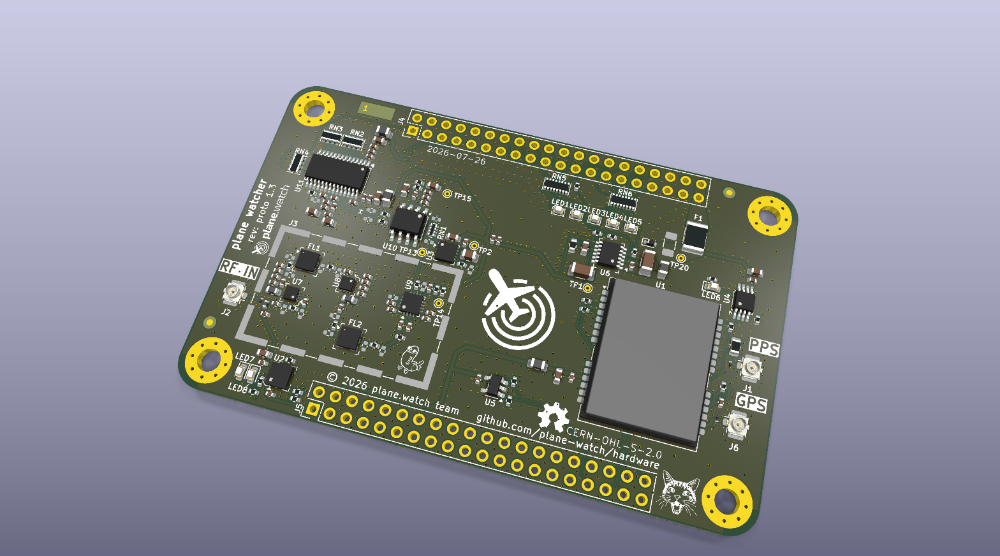

# Plane Watch hardware

Open hardware designs from Plane Watch for receiving and decoding aircraft surveillance signals.

## Hardware projects

| Project | Preview Image | Description |
| ------- | ------------- | ----------- |
| [ADSBoost](adsboost/README.md) |  | A receive-only, bias-tee-powered low-noise amplifier and SAW filter module for 1,090 MHz ADS-B and Mode S reception. ADSBoost is designed to be installed close to the antenna; the current prototype is awaiting assembly and performance testing. |
| [Plane Watcher](planewatcher/README.md) |  | An open source, hardware-based ADS-B receiver and decoder for the HelloFPGA Smart ZYNQ SL. Plane Watcher combines a dual-stage RF front end, log detector, ADC and GNSS timing to support FPGA message decoding and accurate MLAT timestamping. |

## License

Unless a project or file explicitly states otherwise, all original hardware design files in this repository are licensed under the [CERN Open Hardware Licence Version 2 – Strongly Reciprocal (CERN-OHL-S-2.0)](LICENSE).

The CERN-OHL-S-2.0 permits commercial use, but its reciprocal requirements apply when covered source or products based on it are distributed. Alternative commercial licensing is available for organisations that need different terms.

In short: you may use and modify the designs privately. If you distribute modified source or products based on them, the CERN-OHL-S-2.0 requirements apply.

## Third-party materials disclaimer

This repository may include third-party datasheets, application notes and other technical documentation. These materials remain the copyright of their respective owners, are not covered by the repository's hardware licence, and are included solely to assist development and interoperability of the hardware projects.

If you are a copyright holder and have concerns about material included here, please open an issue or contact the maintainers.
