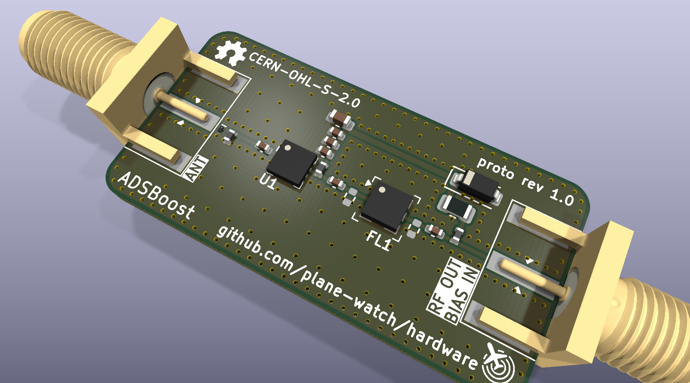

# ADSBoost

**ADSBoost** is an open source, receive-only LNA and SAW filter module for 1090 MHz ADS-B and Mode S reception. It is intended to be installed close to the antenna and powered through its RF output coax using a bias tee.

## Expected performance

> ADSBoost is currently a prototype. The module-level figures below are design estimates derived from the component datasheets; they are not production-tested. They will be replaced with measured results after the first assembled boards have been characterised.

| Parameter | Expected performance | Notes |
| --- | --- | --- |
| Application | 1090 MHz ADS-B and Mode S reception | Receive only; do not connect the input to a transmitter |
| Centre frequency | 1090 MHz | Set by the TA2003A SAW filter |
| Specified passband | 1087-1093 MHz | 6 MHz nominal filter bandwidth |
| In-band gain | Approximately 15 dB typical | Estimated from approximately 18 dB LNA gain at 1090 MHz minus 3.2 dB typical SAW insertion loss and small PCB losses |
| Noise figure | Approximately 0.5-0.7 dB expected | Estimate including the input network; measurement pending |
| RF impedance | 50 ohms nominal | Both ports |
| Operating temperature | -40 to +85 degrees C design range | Limited by the SAW filter; module not yet environmentally qualified |
| Supply voltage | See [Powering ADSBoost](#powering-adsboost) | DC is supplied through the RF output connector |
| Supply current | Approximately 45-68 mA typical | Depends on supply voltage; allow at least 100 mA from the bias tee |

The [Qorvo TQP3M9036](https://www.qorvo.com/products/p/TQP3M9036) LNA has approximately 18.4 dB typical gain and 0.42 dB minimum noise figure around 1090 MHz when operated from 5 V. The [TA2003A datasheet](https://www.taisaw.com/assets/PDF/TA2003A%20_Rev.1.0_.pdf) specifies 3.2 dB typical and 4.0 dB maximum insertion loss across 1087-1093 MHz.

The SAW filter also specifies the following out-of-band attenuation. These are component specifications rather than measured module limits.

| Frequency range | Minimum attenuation |
| --- | ---: |
| DC-970 MHz | 45 dB |
| 1046 MHz | 40 dB |
| 1150-1300 MHz | 45 dB |

Module input/output return loss, gain variation, compression point and linearity remain to be measured on assembled hardware.

## Connections

| Connector | Function |
| --- | --- |
| `J1` / `ANT_IN` | RF input from the antenna; no DC should be applied here |
| `J2` / `RF_OUT+BIAS` | Amplified and filtered RF output, and positive DC bias input |

## Powering ADSBoost

ADSBoost is powered through `J2` using a bias tee. The coax centre conductor must be positive and the shield must be ground. The bias tee should present the DC supply on its RF+DC port while preventing that DC from reaching the receiver's RF input.

The TQP3M9036 datasheet specifies:

| LNA operating point | Device supply current |
| --- | ---: |
| 3.3 V | Approximately 45 mA typical |
| 4.0 V | Approximately 50 mA typical |
| 5.0 V | Approximately 68 mA typical; 40-90 mA datasheet range |

The LNA's recommended device supply range is **3.3-5.25 V**. ADSBoost includes a 1 ohm series protection/filter resistor, which introduces a small voltage drop. Therefore:

- Supply **3.4-5.0 V DC at `J2`**, with 5.0 V recommended.
- Use a low-noise, regulated supply capable of at least **100 mA**.
- Treat all stated voltages as voltages at the module. Coax and bias-tee resistance may produce an additional voltage drop.
- Do not apply DC to `J1`.
- Do not reverse the supply polarity.

### Overvoltage warning

The board includes a [BZT52C6V2](https://www.diodes.com/part/view/BZT52C6V2/) 6.2 V zener diode and a 1 ohm series resistor to help clamp short transients. **This circuit is not a voltage regulator and does not make sustained overvoltage safe.**

Do not exceed the LNA's 5.25 V recommended operating limit. Its 7 V absolute maximum rating is a damage threshold, not an acceptable supply voltage. A sustained excessive voltage can overheat or destroy the zener diode, series resistor and LNA. In particular, applying 12 V through a common masthead-amplifier bias supply is likely to damage the module.

## Enclosure

ADSBoost is designed to fit either of these 100 mm split aluminium enclosures from JLCMC:

- [Aluminum Box (JLC) – 25 × 25 × 40 mm, Split (K1-2525-H6-L40), Natural](<https://jlcmc.com/product/b/U01/BR12070/aluminum-box-(jlc)-25*25*100mm-split>)
- [Aluminum Box (JLC) – 25 × 25 × 40 mm, Split (K1-2525-H7-L40), Black](<https://jlcmc.com/product/b/U01/BR12071/aluminum-box-(jlc)-125*25*100-split>)

Installation requires one **6.6 mm diameter hole in the centre of each end cap**, aligned with the RF connectors.

## License

The hardware design files are licensed under the [CERN Open Hardware Licence Version 2 – Strongly Reciprocal (CERN-OHL-S-2.0)](LICENSE).

The CERN-OHL-S-2.0 permits commercial use, but its reciprocal requirements apply when covered source or products based on it are distributed.

Alternative commercial licensing is available for companies that need different terms.

TL;DR: You can use and modify the design privately. If you distribute modified source or products based on it, the CERN-OHL-S-2.0 requirements apply. If those terms do not work for you, talk to us.

## Notice

This repository may include third-party datasheets, application notes, and technical documentation.

Such materials remain the copyright of their respective owners and are included solely to assist development and interoperability of this project.

If you are a copyright holder and have concerns regarding included materials, please open an issue or contact the maintainers.
