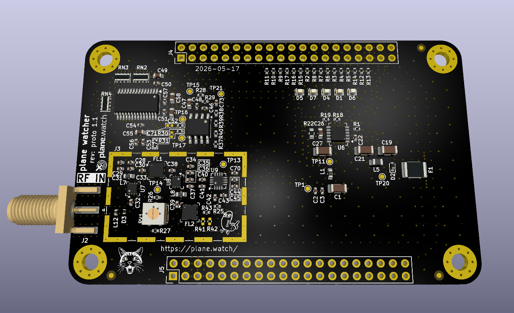
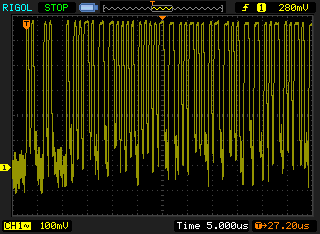

# plane watcher

The **plane watcher** is our attempt at creating a hardware-based ADS-B receiver and decoder. It is a hat/cape/shield for a [HelloFPGA Smart ZYNQ SL](http://www.hellofpga.com/index.php/2023/05/10/smart-zynq-sl/) board.

The goal of the project is to make a reasonably priced yet high quality ADS-B receiver for hobbiests, that achieves high MLAT accuracy by including GPS timing and message decoding in hardware.

## Status

We are currently working on our first prototype. This is not yet ready for use. We don’t know if it works yet…

## Design

The design consists of these parts:

### RF Input

The signal from the antenna is amplified and filtered using two stages of LNA amplification and SAW filters centred on 1090MHz.

### Log Detector

The amplified and filtered RF signal is fed into a log detector. This device shows the RF power level. With an oscilloscope on the output of this device, we can read the raw ADS-B pulses and decode them by hand.

### ADC

The pulse output is fed into an analog to digital converter (ADC) through a differential driver. This allows digital sampling of the pulses.

### FPGA

The FPGA contains bytecode to perform the ADS-B decoding via discrete logic blocks. The FPGA decodes the pulses sampled by the ADC and decodes into usable ADS-B messages. 

## TODO List

 - add GPS module to board.
 - check if the ADC digital supply can operate from FPGA’s 3V3 supply to further reduce noise on the LT3045-1 supply.
 - check test points when prototype is returned, to ensure voltages and expected signals are correct.
 - if signal is too hot on prototype, consider fitting pi pad parts. 
 - VNA front end to determine if additional tuning required.

## Attributions

 - [“1.09 GHz Mode-S Receiver Design and
VHF Radar Antenna Characterization”, Senior Thesis in Electrical Engineering, Dabin Zhang](https://www.ideals.illinois.edu/items/47640/bitstreams/139976/data.pdf).
 - [Project “ADS-B Receiver and Decoder” presentation by Günter Köllner, DL4MEA](https://www.qsl.net/dl4mea/fpgaadsb/Koellner_Projekt-ADSB3.pdf).
 - “Dickbutt” appears courtesy of [K.C. Green](https://kcgreendotcom.com/). RF performance gains are unverified.

## License

Public licence: CERN-OHL-S-2.0

Commercial carve-out: Companies that want different terms can enter a separate commercial agreement.

TL;DR: If you are happy to keep your changes open, use the public licence. If you want private modifications, proprietary integration, or some other commercial arrangement, talk to us.
