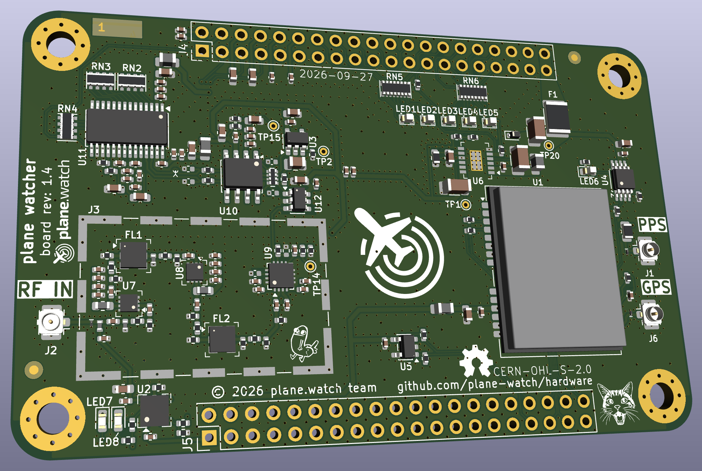
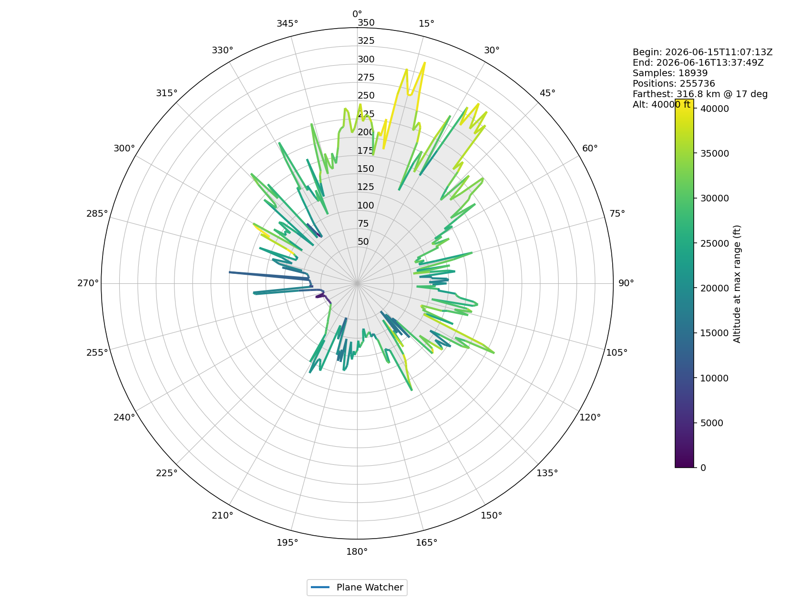
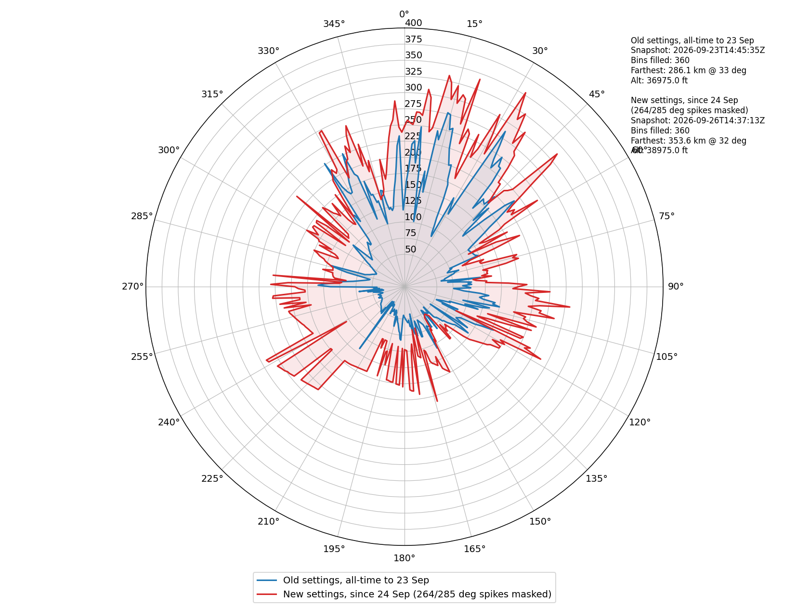
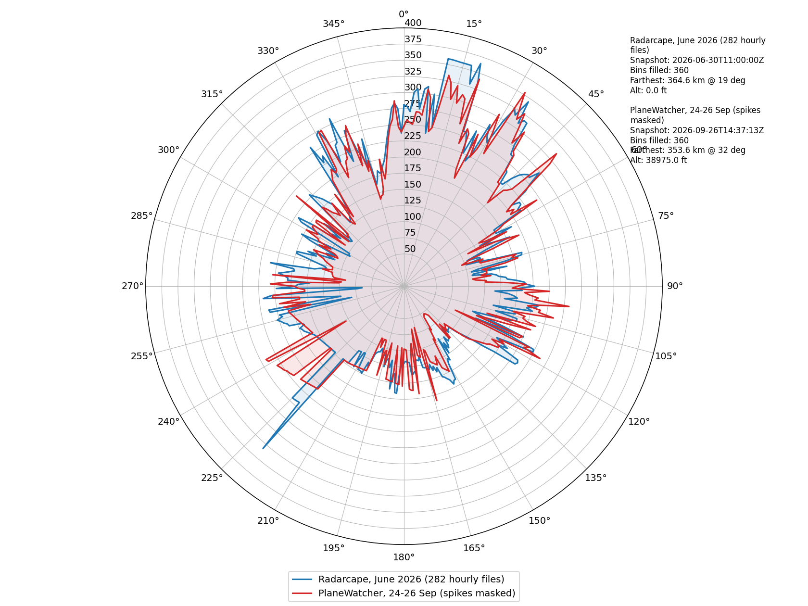
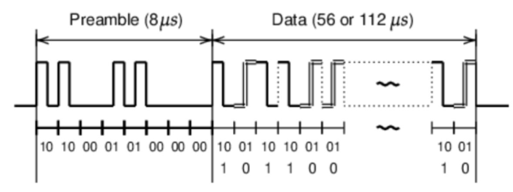
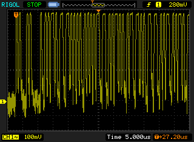

# plane watcher

The **plane watcher** is our attempt at creating an open source, hardware-based ADS-B receiver and decoder. It is a hat/cape/shield for a [HelloFPGA Smart ZYNQ SL](http://www.hellofpga.com/index.php/2023/05/10/smart-zynq-sl/) board.

The goal of the project is to make a reasonably priced yet high-quality ADS-B receiver for hobbyists. It is designed to support accurate MLAT timestamping using GNSS timing and message decoding in the FPGA.

This repository contains the hardware design. The FPGA gateware and software live in the [plane-watch/plane-watcher](https://github.com/plane-watch/plane-watcher) repository.

## Status

Prototype board revision 1.3 is the latest fabricated and tested revision. Production board revision 1.4 is still being refined and has not yet been fabricated or validated.

### Prototype Board Revision 1.2

The first fabricated prototype worked, but had a few issues:

- The SMA connector for the 1090 MHz RF input fouled on the RJ45 Ethernet connector of the FPGA board. For proto 1.3, the RF and GPS antenna connectors have been swapped to U.FL. We will use pigtails to panel-mount SMA connectors.
- The ADL5513 log-detector output was not strong enough to drive the AD8138 ADC driver gain/feedback network directly. Increasing the gain/feedback resistor values from 499 Ω to 4.7 kΩ fixed this on the prototype. In proto 1.3, the ADL5513 output is also buffered.
- We did not have component footprints to tweak the ADL5513 output slope. These have been added to proto 1.3 to allow further refinement if required.
- The 1PPS LED was way too bright on the prototype, so this has been dimmed for proto 1.3.
- The ADL5513 TADJ trimmer network was too high impedance (I should've read the data sheet better) and did not appear to make any difference whatsoever. This has been replaced with a simple voltage divider set to around 0.86 V, in line with the datasheet guidance.

Regardless of the issues, we observed a reception range of approximately 320 km.

### Prototype Board Revision 1.3

In addition to fixing the issues above, proto 1.3 includes some functionality and layout changes:

- More unpopulated component footprints have been added to allow tweaking/refinement:
  - ADL5513 log-detector slope adjustment voltage divider.
  - AD8138 ADC driver feedback capacitors.
  - Five 0402 pi-pad matching networks along the RF path: one on each side of both LNA stages, and one at the ADL5513 RF input. These enable us refine the 1090 MHz matching and compensate for real-world PCB and component parasitics.
    - The first footprint was populated with additional shunt inductance to greatly improve RF performance.
  - Other tweaking footprints along the ADC signal path.
- The ADL5513 log-detector output is buffered by a high-speed ADA4807-1 op-amp for more robust operation with weak signals, and to decouple it from the AD8138 input network.
- The buffered log-detector output is also fed into a first-order low-pass filter at approximately 0.072 Hz to produce a slow-moving analog baseline. This heavily attenuates short ADS-B pulse bursts, but sustained RF traffic can still affect the baseline. The baseline is buffered by an OPA320 and applied to the AD8138 ADC driver input network, offsetting the detector output before digitisation and improving the usable ADC range for weak pulses.
- RF_IN and GPS antenna connectors have been swapped from SMA to U.FL allowing them to be fitted by the manufacturer, making hand assembly easier.
- A software-controlled bias tee has been added. This can supply around 4.5 V to the RF_IN connector, current-limited to approximately 300 mA. LEDs have been added to show whether bias tee is enabled/disabled, and to show if overcurrent disable has been activated.
- A GNSS-disciplined 1PPS timing output has been added. This is a buffered copy of the LEA-M8T TIMEPULSE signal, provided on a 50 Ω source-terminated U.FL connector. The centre pin carries an active-high pulse and the shell is connected to ground. The output is approximately 0 to 4.5 V into a high-impedance load, or approximately 0 to 2 V into a 50 Ω terminated load. The rising edge should be treated as the timing reference.
- Some discrete resistors have been replaced with resistor arrays to reduce the BoM and make hand assembly easier.
- The ADC supply, reference and VOCM networks have been reworked in an attempt to reduce noise, including additional bypassing, ferrite isolation and improved grounding.
- Selectable REFSENSE links allow the ADC input range to be configured for 1 Vpp or 2 Vpp.
- PCB grounding and sensitive-node isolation have been revised with additional via stitching, shorter reference routing and copper keepouts.
- Additional high-frequency bypassing has been added to keep the bias-tee supply side at RF ground.
- Re-routed ADC input differential pair to remove vias/crossovers & remove skew. The ADC output will need to be negated in software.

Compared to proto 1.2 (blue), the range for proto 1.3 (red) has improved by approximately 70km:

Proto 1.3 (red) performance is roughly on-par with a commercial [Jetvision Radarcape](https://radarcape.com) unit (blue):

## Hardware overview

The design has the following main components and interfaces:

| Function | Implementation |
| --- | --- |
| RF input | 1090 MHz ADS-B, U.FL connector |
| RF front end | Two LNA and SAW filter stages |
| Log detector | ADL5513 |
| Baseband buffers | ADA4807-1 fast-path buffer and OPA320 slow-baseline buffer |
| ADC driver | AD8138 |
| ADC | AD9203, 10-bit, up to 40 MSPS |
| GNSS timing | LEA-M8T with FPGA and external 1PPS outputs |
| Bias tee | Software-controlled, approximately 4.5 V at approximately 300 mA with over-current protection |
| Local power | LT3045 low-noise 3.3 V RF/analog supply |
| FPGA carrier | HelloFPGA Smart ZYNQ SL |

## Connections

| Reference | Connection                 | Connector / pinout                                     | Function                                                                                                                    | Voltage and current                                                                                                                                                                                                                                         |
|-----------|----------------------------|--------------------------------------------------------|-----------------------------------------------------------------------------------------------------------------------------|-------------------------------------------------------------------------------------------------------------------------------------------------------------------------------------------------------------------------------------------------------------|
| **J1**    | **1PPS output**            | U.FL; centre = signal, shell = ground                  | Buffered, non-inverting GNSS TIMEPULSE output. Configure for active-high 1PPS with the rising edge as the timing reference. | With a nominal 4.5 V supply: approximately **0–4.5 V into high impedance**, or **0–2.0 V into 50 Ω**, delivering approximately **40 mA while high**. Includes a 49.9 Ω series resistor; total source resistance is approximately 65 Ω including the driver. |
| **J2**    | **1090 MHz RF input**      | U.FL; centre = RF and optional DC bias, shell = ground | Antenna input for the ADS-B receiver; nominal 50 Ω RF interface.                                                            | Software-controlled bias tee supplies approximately **4.5 V** when enabled. Current-limit threshold is approximately **320 mA**. Sustained overload causes latched shutdown.                                                                                |
| **J6**    | **GNSS antenna input**     | U.FL; centre = RF and DC bias, shell = ground          | Antenna input to the LEA-M8T GNSS receiver; nominal 50 Ω RF interface.                                                      | Active-antenna power is provided through the LEA-M8T antenna-supply circuit.                                                                                                                                                                                |
| **J4**    | **FPGA bank 33 interface** | 40-pin header                                          | Carries the ADC sample clock, 10-bit ADC data, overrange indication, RGB LED controls and regulator power-good signal.      | Receives nominal **3.3 V** on pins **37–38** and approximately **4.5 V FPGA_VCC** on pins **39–40**; ground on pins **35–36**. The 4.5 V input feeds the local regulator (for RF and ADC analog side) and 1PPS driver.                                      |
| **J5**    | **FPGA bank 35 interface** | 40-pin header                                          | Carries GNSS serial/control/timing signals, EEPROM I²C, and bias-tee enable/fault signals.                                  | Receives approximately **4.5 V FPGA_VCC** on pins **1–2** and nominal **3.3 V** on pins **3–4**; ground on pins **5–6**. Supplies the bias tee, GNSS and EEPROM circuits. Available current depends on the carrier board.                                   |

## Blinkenlights

The board currently has 8 LEDs, which are used as follows:

| LED  | Type                            | Purpose                                                                                                             |
|------|---------------------------------|---------------------------------------------------------------------------------------------------------------------|
| LED1 | RGB, software controlled        | **System status:** red (FIFO-full latched) > amber (decoder disabled) > green heartbeat (PL alive and clocking) |
| LED2 | RGB, software controlled        | **DF17 activity** green flash per DF17 extended squitter                                                        |
| LED3 | RGB, software controlled        | **DF11/valid** blue flash per DF11 / accepted message                                                           |
| LED4 | RGB, software controlled        | **Decode health** red when invalid DFs outpace accepted messages, else green while messages flow                |
| LED5 | RGB, software controlled        | reserved for PS override (app/feeder status)                                                                        |
| LED6 | "Pink" (looks white), hardwired | 1PPS from GNSS module (when locked)                                                                                 |
| LED7 | Green, hardwired                | Lit when bias-tee enabled                                                                                           |
| LED8 | Red, hardwired                  | Bias-tee over-current shutdown or thermal shutdown                                                                  |

## Design

The design consists of the following parts:

### RF Input

The signal from the antenna is amplified and filtered using two stages of LNA amplification and SAW filters centred on 1090 MHz.

A switchable bias tee power supply can apply approximately 4.5 V at up to approximately 300 mA to the RF_IN connector.

LED7 (green) indicates bias-tee is enabled.
LED8 (red) indicates an overcurrent shutdown of bias-tee.

### Log Detector

The amplified and filtered RF signal is fed into an ADL5513 log detector, which produces a voltage proportional to the logarithm of the RF input power. With an oscilloscope on its output, we can see the raw ADS-B pulses and decode them by hand.

### ADC Driver

The ADL5513 log-detector output is buffered with a high-speed ADA4807-1 op-amp to isolate it from the ADC driver input network and provide a robust baseband signal. Without the buffer, the output of the log detector is too weak for the gain/feedback network surrounding the AD8138.

The ADC uses a differential input. To drive it, the buffered baseband signal is split:

- Through the gain/input resistor network into the AD8138 positive input summing node.
- Into a first-order low-pass filter at approximately 0.072 Hz, producing a slow-moving analog baseline with short ADS-B pulse bursts heavily attenuated. This baseline is then buffered by an OPA320 to decouple it from the ADC driver input network and applied through the gain/input resistor network into the AD8138 negative input summing node.

The AD8138 produces a differential output proportional to the difference between the instantaneous log-detector output and the slow noise-floor estimate.

### ADC

The differential output of the ADC driver is fed into an AD9203 10-bit, 40 MSPS ADC. The ADC input range can be configured for 1 Vpp or 2 Vpp using selectable REFSENSE links. By default, 2 Vpp is used to give the largest dynamic range. The FPGA supplies the sample clock and receives the digitised output.

### GNSS Timing

The LEA-M8T GNSS timing receiver provides its TIMEPULSE signal to the FPGA for timestamping. Proto 1.3 also buffers this signal for an external, source-terminated 1PPS output and a status LED (LED6).

### EEPROM

The board contains a 16K I²C EEPROM. The EEPROM data is written once at assembly time and read back at boot-time to set board details such as MAC address, serial number, credentials, etc.

### Power

The power supplies are split in an attempt to reduce noise on the RF & ADC supply.

#### RF & ADC

The RF and analog ADC sections are powered from the approximately 4.5 V FPGA_VCC rail provided by the carrier board (5V from the USB-C connector, through a Schottky diode). The input has resettable overcurrent and transient protection. A ferrite-filtered LT3045-1 linear regulator generates the local low-noise 3.3 V RF/analog supply, with additional ferrite isolation and local bypassing around the ADC.

The ADC digital power is fed directly from the FPGA board 3V3 rail.

#### Bias-Tee, GNSS & EEPROM

These are powered directly from the FPGA board:

- Bias-Tee current is supplied by the approximately 4.5 V FPGA_VCC rail
- The GNSS module is powered directly from the FPGA board 3V3 rail. The 1PPS output is powered from the approximately 4.5 V FPGA_VCC rail via a MOSFET driver.
- The EEPROM is powered directly from the FPGA board 3V3 rail.

### FPGA

The FPGA gateware samples the ADC output, detects and timestamps ADS-B pulses, and converts them into usable messages. The gateware and supporting software are developed in the [plane-watch/plane-watcher](https://github.com/plane-watch/plane-watcher) repository.

## Attributions

- [“1.09 GHz Mode-S Receiver Design and
  VHF Radar Antenna Characterization”, Senior Thesis in Electrical Engineering, Dabin Zhang](https://www.ideals.illinois.edu/items/47640/bitstreams/139976/data.pdf).
- [Project “ADS-B Receiver and Decoder” presentation by Günter Köllner, DL4MEA](https://www.qsl.net/dl4mea/fpgaadsb/Koellner_Projekt-ADSB3.pdf).
- The [Open Source Hardware gear logo](https://oshwa.org/resources/open-source-hardware-logo/) was designed by Macklin Chaffee and is licensed CC-SA.
- “Dickbutt” appears courtesy of [K.C. Green](https://kcgreendotcom.com/). RF performance gains are unverified.

## License

The hardware design files are licensed under the [CERN Open Hardware Licence Version 2 – Strongly Reciprocal (CERN-OHL-S-2.0)](LICENSE).

The CERN-OHL-S-2.0 permits commercial use, but its reciprocal requirements apply when covered source or products based on it are distributed.

Alternative commercial licensing is available for companies that need different terms.

TL;DR: You can use and modify the design privately. If you distribute modified source or products based on it, the CERN-OHL-S-2.0 requirements apply. If those terms do not work for you, talk to us.

## Notice

This repository may include third-party datasheets, application notes, and technical documentation.

Such materials remain the copyright of their respective owners and are included solely to assist development and interoperability of this project.

If you are a copyright holder and have concerns regarding included materials, please open an issue or contact the maintainers.
