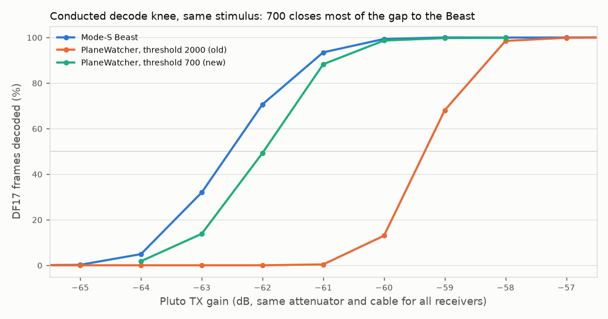
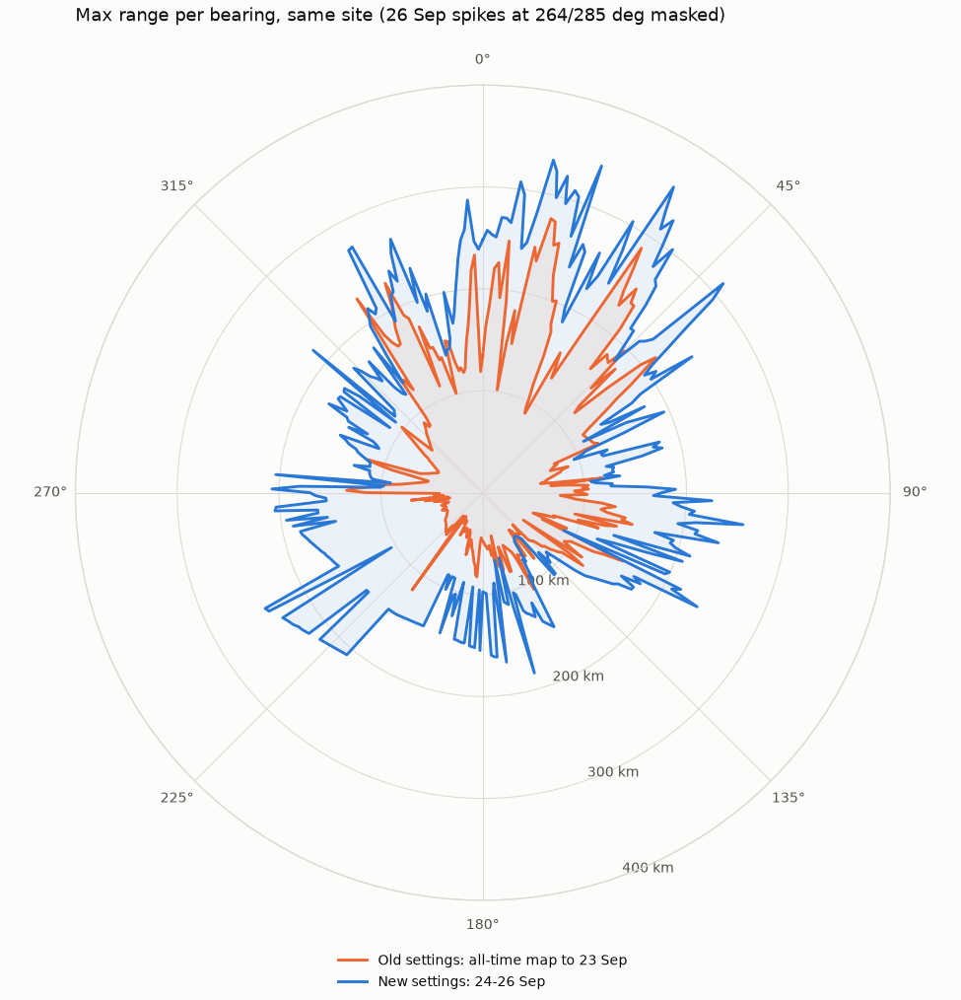
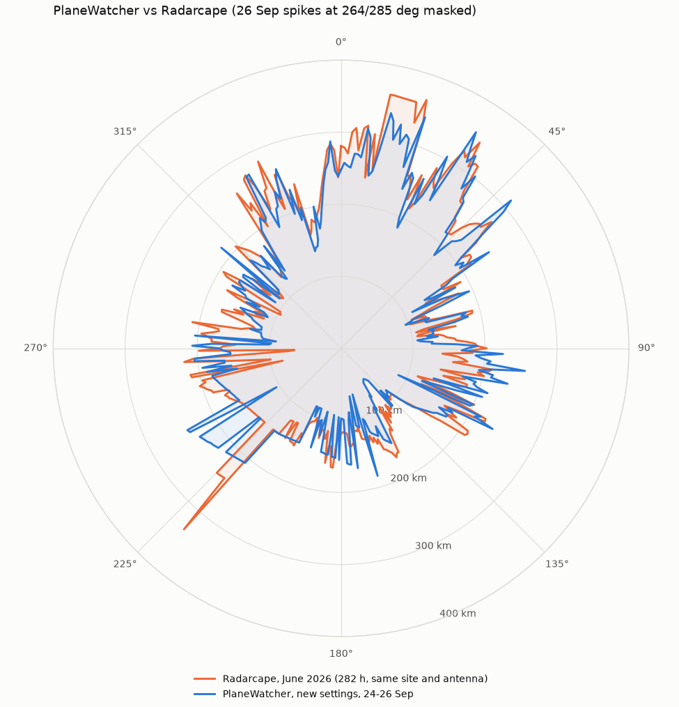

# Rev 1.3 frontend sensitivity: finding and fix (September 2026)

## Summary

The rev 1.3 receiver was about **3 dB less sensitive than a Mode-S Beast** on
the same conducted stimulus. The analogue frontend was not the cause. The
preamble detector's **absolute power threshold (2000 at 32 MS/s)** rejected
weak frames that the ADC samples still carried cleanly. Its **32 µs holdoff**
also let every false trigger blank real frames.

Setting `power_threshold` to **700** and the holdoff to **8 µs** moved the
conducted decode knee to within **0.5 dB of the Beast**, with no noise
triggers on a terminated input. On air at the usual site, the median maximum
range per bearing rose from **76 km to 164 km**, and coverage is now roughly
level with a Radarcape that used the same site and antenna. The new values
are the bitstream reset defaults on software `main` (commit `f842867`).

## How it was localised

1. **The ADC samples carry the bits past the knee.** At the level where
   PlaneWatcher decoded 0.4% of frames (and the Beast 93%), raw ADC captures
   still separated every PPM bit at μ/σ ≈ 4.7; 34/34 bits of one window
   matched the transmitted frame. An ideal decision on those samples reaches
   50% about 5 dB lower than PlaneWatcher did. The loss was after the ADC
   ([data/adc-bit-margin-20260923.json](data/adc-bit-margin-20260923.json),
   [plots/adc-window-61.png](plots/adc-window-61.png)).
2. **The first preamble gate rejects them.** The FPGA's per-stage counters
   showed thousands of pulse edges at −61/−62 dB. Only 969 and 4 detections
   passed the absolute power threshold; the quiet-zone and SNR gates passed
   nearly everything that reached them
   ([data/sweeps/funnel.json](data/sweeps/funnel.json)).
3. **The threshold closes the gap.** 50% decode point (Pluto gain; the same
   attenuator and cable for every receiver). "Idle" counts detections in 10 s
   with the source off:

   | `power_threshold` | 50% point | vs Beast (−62.53) | idle detections, 10 s |
   | ---: | ---: | ---: | ---: |
   | 2000 (old) | −59.35 | 3.2 dB worse | 0 |
   | 1000 | −61.19 | 1.3 dB worse | 0 |
   | **700** | **−61.98** | **0.55 dB worse** | **0** |
   | 500 | −62.69 | level | 13 (2 junk messages) |

4. **The holdoff, not decoder occupancy, loses frames to false triggers.**
   After any detection the detector ignores new preambles for the holdoff.
   A load test injected valid frames plus bare preambles, never overlapping
   on air. Loss followed holdoff blanking, not exhaustion of the 8 decoder
   slots ([data/sweeps/load/](data/sweeps/load/),
   [data/sweeps/holdoff/](data/sweeps/holdoff/)):

   | False triggers/s | 32 µs (old) | **8 µs** | 120 µs |
   | ---: | ---: | ---: | ---: |
   | 2,660 | 92.9% | **99.9%** | 72.9% |
   | 8,800 | 85.2% | **99.9%** | 51.5% |

   The cost of 8 µs is more payload retriggers: about 12 detections per long
   frame instead of 4, filtered on the PS side. Modelled, 8 decoders reach
   about 1% blocking near 2,000 long frames/s. More decoder slots and early
   release of hopeless candidates would restore margin.

## On-air result

| Sector median | Old settings (all-time) | New settings (24–26 Sep) | Radarcape, June |
| --- | ---: | ---: | ---: |
| North 330–30° | 166 km | 249 km | 257 km |
| East 60–120° | 95 km | 172 km | 163 km |
| South 150–210° | 56 km | 123 km | 130 km |
| West 240–300° | 49 km | 157 km | 166 km |

Caveats:

- This is not a controlled A/B. The traffic and accumulation times differ,
  and about 18 h of the new-settings window ran on the old settings after a
  firmware slot switch dropped the runtime override.
- Two 26 September bins (264° and 285°, 603 and 566 km) lie beyond the radio
  horizon for their altitudes. They are bad position decodes and are masked
  in the plots.
- Radarcape figures come from its hourly range files; 282 of June's 696
  hours were available.
- The coverage data holds bearing, range and altitude only.

## Ruled out along the way

- **Input matching:** measured mismatch loss at the antenna input is about
  0.3 dB. Z13 = 68 nH is a small, real improvement, and a second 68 nH at Z15
  added about 0.07 dB. Matching cannot recover dB-scale sensitivity.
- **Detector noise floor and pre-detector gain:** the ADL5513's own noise
  dominates the floor power, but after video filtering it acts as a benign
  pedestal. Modelled, 10 dB of extra gain or a reactive detector match
  changes detectability by less than 0.5 dB
  ([data/noise-floor-model.json](data/noise-floor-model.json)).
- **FL2 / detector interface:** worst case about 1 dB of post-LNA level,
  which does not affect SNR. An unexplained ~10 dB return loss measured
  through a temporary coax was not pursued further.
- **Long feed runs matter:** cable loss before the first LNA subtracts
  directly from sensitivity (LMR-200 is about 0.57 dB/m at 1090 MHz). Use
  the bias tee and a mast-head LNA for long runs.

## Bench notes worth keeping

- Pluto clones can fail their boot-time AD9361 interface tune. When that
  happens, buffered TX is silent but the DDS still works. The software repo's
  Pluto tools now refuse to transmit when the RX core is missing; reboot the
  Pluto.
- Receiver-side debug counters (`/api/stats?debug=1`) localise decode losses
  far faster than VNA work on internal nodes.

## Contents

- `data/sweeps/`: decode-rate sweeps (Beast, PlaneWatcher), threshold,
  load and holdoff tests, with per-stage FPGA counter deltas.
- `data/coverage/`: coverage snapshots (bearing, km, altitude) and the
  Radarcape June reduction.
- `data/adc-bit-margin-*.json`, `data/noise-floor-model.json`: ADC
  bit-margin and detector-noise analyses. The raw captures are not committed.
- `scripts/`: `make_plots.py` regenerates the plots from `data/`.
  `compare_coverage.py`, `fetch_radarcape_range.py`, `adc_bit_margin.py`,
  `noise_floor_analysis.py` and `plot_adc_window.py` are the analysis tools;
  the last three need raw captures.

The bench tooling (Beast, HackRF and Pluto sweeps, decoder-load generator,
on-air A/B) lives in the software repository under `tools/`.
